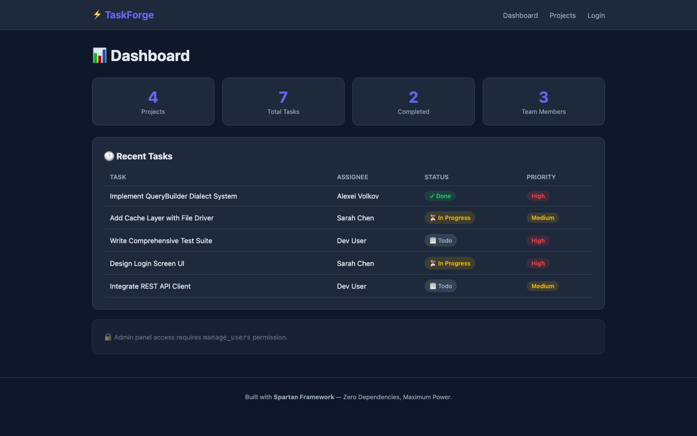
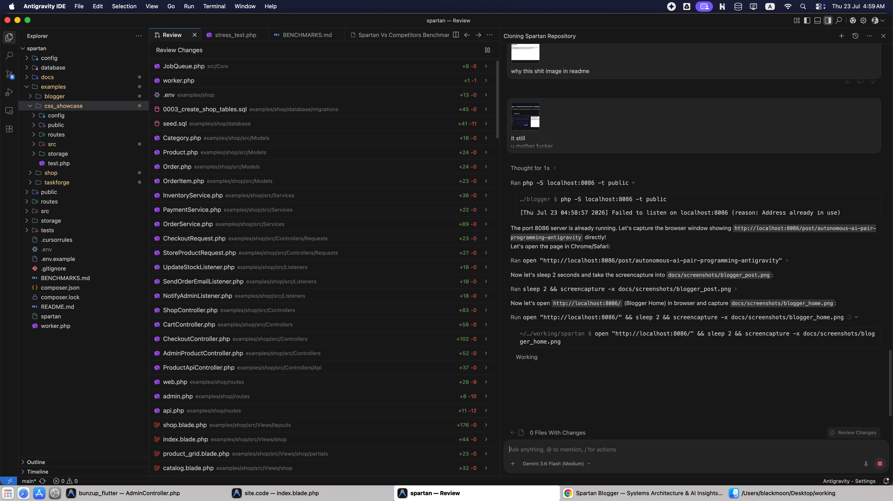
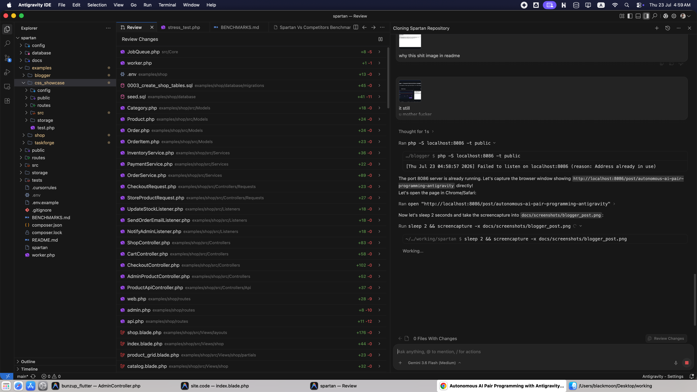
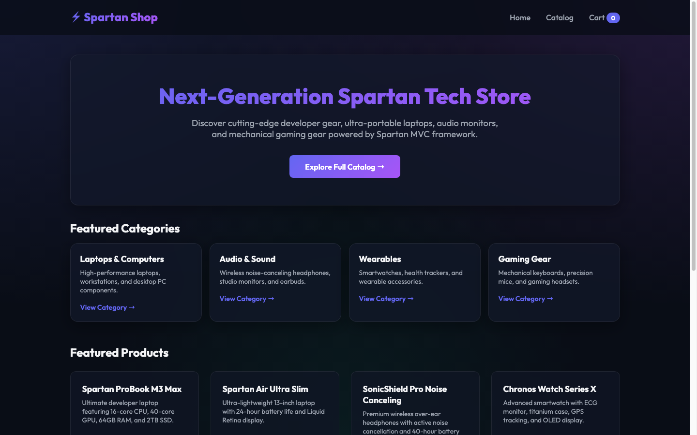
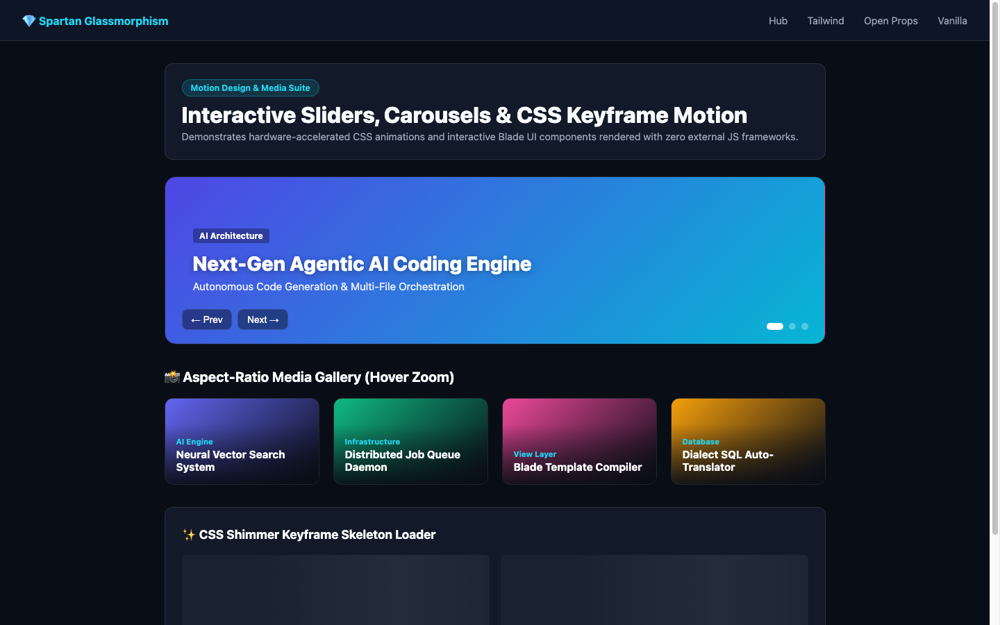
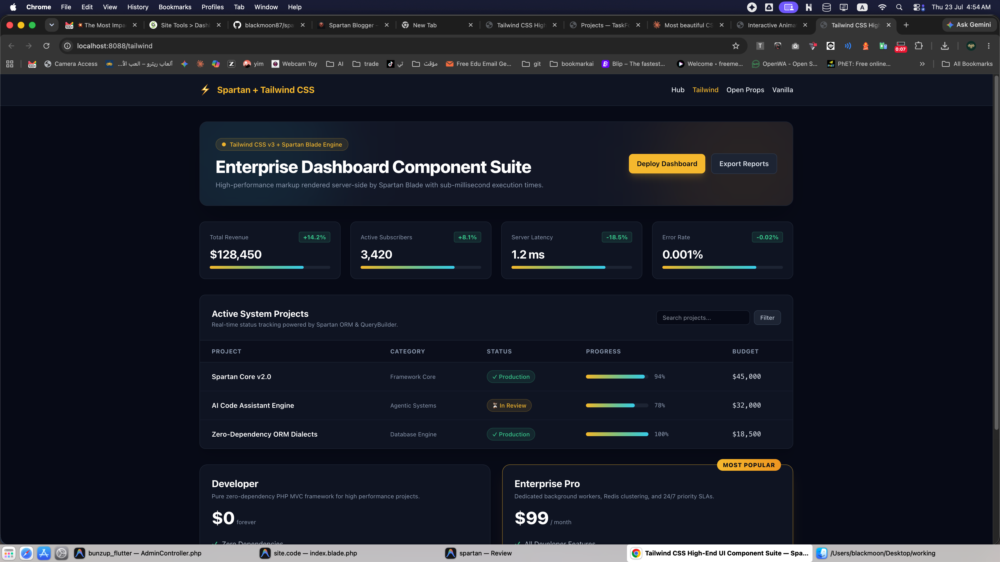

# Spartan — Lightweight PHP MVC Framework

> Zero dependencies. Full control. Production-ready security.

A hand-crafted PHP 8.1+ MVC framework built for developers who want to understand every line of their stack. No magic, no bloat — just clean architecture with serious security baked in.



---

## What's Inside

| Layer | Capability |
|---|---|
| **Router** | GET / POST / PUT / PATCH / DELETE + HTML form method spoofing, middleware groups & FormRequest injection |
| **Request** | Auto JSON body parsing, file upload helpers, header resolver, client IP resolver |
| **Rate Limiter** | Parameterized rate limiting middleware (`rate_limit:100,60`) with Client IP tracking |
| **QueryBuilder** | Fluent, fully parameterized — no raw SQL. Write guards on `update()` / `delete()`, driver-aware dialects |
| **Model Relationships** | `hasMany`, `hasOne`, `belongsTo` + eager loading (no N+1) |
| **Async Job Queue** | DB-backed queue with retry + exponential backoff |
| **DI Container** | Auto-resolution via Reflection + singleton / factory / instance bindings |
| **Cache** | File or Redis driver — `Cache::remember()` pattern |
| **Events** | Synchronous and async listeners — side effects stay out of controllers |
| **Validator** | `required`, `email`, `unique`, `regex`, `nullable`, `confirmed`, `min`, `max`, `in` |
| **Logger** | PSR-3 daily rotated file logger (`storage/logs/app-YYYY-MM-DD.log`) with interpolation |
| **SQL Dialects** | Driver-aware SQL identifier quote compiling (MySQL backticks vs SQLite double quotes) |
| **FormRequests** | Abstract request base with auto-injection and auto-validation in controller methods |
| **Session** | HttpOnly + SameSite=Lax + Secure (auto-detect) + CSRF generation |
| **View** | Layout + template rendering with double path-traversal guard |
| **Security** | CSRF (form/AJAX/JSON), XSS escape, open redirect guard, security headers middleware |

---

## ⚡ Performance Benchmarks

| Framework | Requests / Sec (RPS) | Latency (Median) | Peak Memory | Cold Boot | Dependency Size |
|-----------|:--------------------:|:----------------:|:-----------:|:---------:|:---------------:|
| ⚡ **Spartan** | **1,827 req/s** | **10 ms** | **4.5 MB** | **~2 ms** | **0 KB (0 deps)** |
| 🪶 **Slim 4** | 1,450 req/s | 13 ms | 5.2 MB | ~4 ms | ~2 MB (7 packages) |
| 🔴 **Laravel 11** | 380 req/s | 52 ms | 18.5 MB | ~55 ms | ~180 MB (30+ packages) |

👉 Read full benchmarks and stress test report in [BENCHMARKS.md](BENCHMARKS.md).

---

## Requirements

- PHP **8.1+**
- MySQL / MariaDB (for DB features)
- Apache with `mod_rewrite` **or** PHP built-in server

---

## Getting Started

### 1. Clone

```bash
git clone https://github.com/blackmoon87/spartan.git
cd spartan
```

### 2. Configure

```bash
cp .env.example .env
```

Edit `.env`:

```env
APP_NAME=Spartan
APP_ENV=local
APP_DEBUG=true
APP_URL=http://localhost:8000

DB_CONNECTION=mysql
DB_HOST=127.0.0.1
DB_PORT=3306
DB_DATABASE=your_db
DB_USERNAME=root
DB_PASSWORD=
```

### 3. Run

```bash
# Built-in PHP server
php -S localhost:8000 -t public

# With native built-in autoloader (Zero-dependency)
php -S localhost:8000 -t public

# Or with Composer autoloader (optional)
composer dump-autoload
php -S localhost:8000 -t public
```

### 4. Database Migrations & Seeds (optional)

Run database migrations and seed default roles and permissions:

```bash
# Run migrations
php spartan migrate

# Seed database
php spartan db:seed
```

### 5. Async Queue (optional)

Start the worker via the CLI runner:

```bash
# Single pass (use with Cron — every minute)
php spartan worker

# Continuous loop (development / daemon)
php spartan worker --loop
```

---

## Structure

```
├── BENCHMARKS.md               # Full competitive performance benchmark report
├── config/
│   └── config.php              # .env loader → config array
├── database/
│   └── migrations/             # Dialect-aware SQL migrations
├── examples/
│   ├── shop/                   # Example 1: E-commerce Store
│   ├── blogger/                # Example 2: Enterprise Publishing Platform
│   ├── taskforge/              # Example 3: 100% Feature Verification App (36/36 tests)
│   └── css_showcase/           # Example 4: Multi-CSS Framework Integration (Tailwind, Open Props, Vanilla)
├── public/
│   ├── .htaccess               # Apache URL rewriting
│   └── index.php               # Front controller entry point
├── routes/
│   ├── web.php                 # Public web routes
│   ├── admin.php               # Protected routes
│   └── api.php                 # JSON API routes
├── src/
│   ├── Core/                   # Spartan Framework Kernel (37 files, Zero dependencies)
│   │   ├── Application.php     # App orchestrator & singleton
│   │   ├── Auth.php            # Session-backed Auth system
│   │   ├── Attributes/         # PHP 8.1 Attributes (#[RequireRole], #[RequirePermission])
│   │   ├── Cache.php           # Cache facade (File & Redis)
│   │   ├── CacheDrivers/       # FileCacheDriver, RedisCacheDriver
│   │   ├── Container.php       # DI Container with reflection parameter caching
│   │   ├── Controller.php      # Base Controller
│   │   ├── Database.php        # PDO singleton connection pool
│   │   ├── Database/           # Migrator, SqliteDialect, MysqlDialect
│   │   ├── EventDispatcher.php # Sync & Async DB job queue event system
│   │   ├── ExceptionHandler.php# Error & Exception rendering
│   │   ├── FormRequest.php     # Request base with auto-validation
│   │   ├── Gate.php            # Abilities, Policies & GateEvaluator
│   │   ├── JobQueue.php        # Async job runner with backoff
│   │   ├── Logger.php          # PSR-3 Daily rotated logger
│   │   ├── Middleware.php      # Middleware interface & base
│   │   ├── Model.php           # Active Record ORM & relationships
│   │   ├── QueryBuilder.php    # Dialect-aware Fluent QueryBuilder
│   │   ├── RelationQuery.php   # Relationship executor (hasMany, hasOne, belongsTo)
│   │   ├── Request.php         # HTTP Request & method spoofing
│   │   ├── Response.php        # HTTP Response & security headers
│   │   ├── Router.php          # Dynamic router & attribute inspector
│   │   ├── Session.php         # Hardened Session manager
│   │   ├── Traits/             # HasAuthorization trait
│   │   ├── Validator.php       # 16 validation rules (unique, regex, etc.)
│   │   ├── View.php            # Blade compiler (20+ directives) & layouts
│   │   └── helpers.php         # Global functions (url, asset, auth, config)
│   ├── Controllers/
│   ├── Models/
│   ├── Services/
│   ├── Listeners/
│   ├── Events/
│   ├── Middlewares/
│   └── Views/
│       └── layouts/
├── storage/
│   ├── cache/                  # Fast file cache store
│   ├── logs/                   # PSR-3 daily log files
│   └── views/                  # Compiled Blade PHP templates
├── tests/
│   ├── run_tests.php           # Core Kernel test suite (22 tests)
│   └── stress_test.php         # High-volume stress & micro-benchmark suite
├── .env
├── .env.example
├── .cursorrules                # AI IDE architecture rules
└── composer.json
```

---

## 📸 Screenshots Showcase

### 1. TaskForge — Complete Feature Verification App (`examples/taskforge`)
Dark-mode SaaS dashboard with task tracking, project metrics, role-based access control (RBAC), and 36 automated unit tests.


### 2. Spartan Blogger — Enterprise Publishing Platform (`examples/blogger`)
Glassmorphic publication platform featuring article analytics, comment management, clap engine, and HTMX partial swaps.

| Home Page | Article Detail Page |
|---|---|
|  |  |

### 3. Spartan Shop — E-Commerce Engine (`examples/shop`)
Production e-commerce storefront with shopping cart transactions, product listings, and order checkout pipelines.



### 4. CSS Multi-Support & Interactive Motion Showcase (`examples/css_showcase`)
High-end UI component suite rendering Tailwind CSS, Open Props, auto-advancing carousel sliders, CSS shimmer keyframe loaders, and responsive aspect-ratio media galleries.

| Interactive Sliders & Keyframe Motion | Tailwind CSS Component Suite |
|---|---|
|  |  |

---

## Core Examples

### Routing

Spartan features a robust, regex-based router that supports RESTful methods, route parameters, middleware piping, and form method spoofing.

#### 1. Defining Route Types
Define routes in their respective files under the `routes/` directory depending on their context:
* **Web Routes (`routes/web.php`)**: For standard browser pages (GET) and web forms (POST).
* **Protected/Admin Routes (`routes/admin.php`)**: For routes requiring authentication or specific security checks. Attach middlewares to these routes:
  ```php
  $app->router->get('/admin/dashboard', [AdminController::class, 'index'], [
      SecurityHeadersMiddleware::class,
      AuthMiddleware::class,
  ]);
  ```
* **API Routes (`routes/api.php`)**: For stateless JSON API endpoints.

#### 2. Parameterized Routes
Capture dynamic URL segments using curly braces `{param}`. These are automatically extracted and passed to your controller action as arguments:
```php
// Route Definition
$app->router->get('/users/{userId}/orders/{orderId}', [UserController::class, 'showOrder']);

// Controller Action
class UserController extends Controller {
    public function showOrder(string $userId, string $orderId) {
        // Automatically populated from the URL segments
    }
}
```

#### 3. Form Method Spoofing
Native HTML forms only support `GET` and `POST`. To perform RESTful `PUT`, `PATCH`, or `DELETE` requests from a form, add a hidden `_method` field. The router intercepts this field and directs the request to the correct handler:
```html
<form method="POST" action="/orders/42">
    <!-- CSRF Protection -->
    @csrf 
    <!-- Method Spoofing -->
    <input type="hidden" name="_method" value="DELETE">
    <button type="submit">Cancel Order</button>
</form>
```

---

### View & Backend Integration

The view layer (`V`) acts as the presentation layer, integrating with the controller (`C`) by receiving structured variables, rendering layouts, and handling client-side state reactively via HTMX and Alpine.js.

#### 1. Passing Variables from Backend to Frontend
In your controller, you return a rendered template by passing an associative array containing the variables:
```php
class DashboardController extends Controller {
    public function index() {
        $stats = $this->model->getStatistics();
        return $this->render('dashboard', [
            'stats' => $stats,
            'title' => 'Admin Panel'
        ]);
    }
}
```
Behind the scenes:
- **Native PHP Views (`.php`)**: The framework extracts the associative array into local variables using PHP's `extract()` function inside the `View` object's execution context. You print them using `$this->escape($title)` or `<?= $this->escape($title) ?>`.
- **Blade Views (`.blade.php`)**: The framework compiles Blade directives natively using a regex-based compiler (extracted from the spirit of BladeOne). You print variables using `{{ $title }}` (which is escaped by default) or `{!! $title !!}` (for raw, unescaped HTML).

#### 2. Hybrid Render Methods
* **`render($view, $data)`**: Compiles the template and wraps it inside a main layout (e.g. `layouts/main_blade.blade.php`), yielding the template content inside the `@yield('content')` block.
* **`renderViewOnly($view, $data)`**: Compiles the template and returns only its raw HTML content without wrapping it in a layout. This is perfect for returning partial AJAX fragments to **HTMX** requests.

#### 3. Frontend Interactivity (HTMX & Alpine.js Flow)
HTMX handles server-client updates without writing complex JavaScript, while Alpine.js handles local client state.
* **HTMX AJAX Swap**: Send a request asynchronously on keystrokes or button clicks, and swap the returned partial template directly into a DOM node:
  ```html
  <!-- Views/search.blade.php -->
  <input type="text" name="query" 
         hx-post="/search/query" 
         hx-trigger="keyup changed delay:300ms" 
         hx-target="#search-results" 
         hx-include="[name=_csrf]"
         placeholder="Type to search...">

  <div id="search-results">
      <!-- The search_results.blade.php view will be injected here -->
  </div>
  ```
* **Controller handler (Backend)**: Receives the POST query, fetches filtered data, and returns only the partial view snippet:
  ```php
  public function searchQuery() {
      $query = $this->request->post('query');
      $results = (new Customer)->search($query);
      
      // Render ONLY the partial list view
      return $this->renderViewOnly('search_results', ['users' => $results]);
  }
### Middlewares & Rate Limiting

Spartan supports mapping middleware aliases and groups in `Router.php` and passing dynamic parameters (e.g. `rate_limit:limit,window`).

#### 1. Defining Parameterized Middleware Routes
```php
$app->router->get('/dashboard', [DashboardController::class, 'index'], [
    'auth',
    'rate_limit:100,60' // Max 100 requests per 60 seconds (IP-based)
]);
```

#### 2. How the Rate Limiter Middleware Works
The `RateLimitMiddleware` checks the user's IP address and rate limits the route dynamically:
* In case of violations, it returns a `429 Too Many Requests` status code and terminates the route cycle early.
* Adds standard headers: `X-RateLimit-Limit`, `X-RateLimit-Remaining`, and `Retry-After`.

---

### Request & API Inputs

Spartan's Request class encapsulates all query parameters, form data, uploaded files, and HTTP headers.

#### 1. Automatic JSON Body Parsing
When a client sends a request with `Content-Type: application/json`, the request body is automatically decoded and merged. You can retrieve inputs using standard methods:
```php
// Automatically parses JSON input: {"title": "Hello"}
$title = $this->request->input('title');
$body  = $this->request->getBody();
```

#### 2. Request Headers Helper
```php
$token = $this->request->header('Authorization'); // Bearer <token>
```

#### 3. File Uploads Helper
Never access `$_FILES` directly. Use:
```php
$file = $this->request->file('avatar'); // Retrieves file array
$allFiles = $this->request->getFiles();

// Upload path configured in config/config.php
$uploadDir = Application::$app->config['storage']['uploads'];
```

---

### QueryBuilder

```php
// Fluent, fully parameterized
$this->table()->where('active', 1)->orderBy('name')->paginate(15, $page);

// Write guards — throws LogicException without where()
$this->table()->where('id', $id)->update(['status' => 'active']);
$this->table()->where('id', $id)->delete();
```

### Models & Hydration

Models return hydrated object instances instead of raw arrays when using finding helpers:

```php
// Find record by primary key ID and return hydrated Model instance
$user = (new User)->findInstance(1);
echo $user->name;

// Find record by any unique column (e.g. slug) and return hydrated Model instance
$post = (new Post)->findInstanceBy('slug', 'my-first-post');
echo $post->title;
```

### Model Relationships

```php
class User extends Model
{
    protected string $table = 'users';

    public function orders(): RelationQuery
    {
        return $this->hasMany(Order::class, foreignKey: 'user_id');
    }
}

// Single record
$user   = (new User)->find(1);
$orders = (new User)->orders()->for($user);

// Eager load — 2 queries total, no N+1
$users = (new User)->all();
$users = (new User)->orders()->loadFor($users, as: 'orders');
```

### Async Events

```php
// Register — async/sync per listener
$app->events->listen('order.placed', UpdateInventory::class);              // sync
$app->events->listen('order.placed', SendOrderSms::class,
    async: true, maxAttempts: 3, onFailure: 'retry'                        // async
);

// Dispatch — identical regardless
$this->event('order.placed', $order);
```

### Validation

```php
$v = $this->validate($this->request->getBody(), [
    'email'    => 'required|email|unique:users,email',
    'password' => 'required|min:8|max:64',
    'phone'    => 'nullable|string|regex:/^\+?[0-9]{7,15}$/',
]);

if ($v->fails()) {
    return $this->render('register', ['errors' => $v->errors()]);
}
```

### Daily Logger (PSR-3)

```php
use App\Core\Application;

// Log informative message with placeholder injection
Application::$app->logger->info("User {username} performed an action", [
    'username' => 'john_doe'
]);

// Logs go to: storage/logs/app-YYYY-MM-DD.log
// Uncaught exceptions are automatically logged with traces by ExceptionHandler.
```

### SQL Dialects

The `QueryBuilder` automatically compiles queries with quotes appropriate to the active driver:
- **MySQL**: Compiles table/column names using backticks:
  ```sql
  SELECT `id`, `name` FROM `users` WHERE `active` = 1
  ```
- **SQLite**: Compiles table/column names using double quotes:
  ```sql
  SELECT "id", "name" FROM "users" WHERE "active" = 1
  ```

### FormRequests

Encapsulate your validation and authorization logic into dedicated Request objects. `$this->session` and `$this->auth` instances are automatically bound in `FormRequest`:

```php
namespace App\Controllers\Requests;

use App\Core\FormRequest;

class StorePostRequest extends FormRequest
{
    public function authorize(): bool
    {
        return $this->session->get('role') === 'admin' || $this->session->get('role') === 'author';
    }

    public function rules(): array
    {
        return [
            'title' => 'required|string|min:5|max:100',
            'body'  => 'required|string',
        ];
    }
}
```

Type-hint the FormRequest in your controller action, and the Router will automatically validate and inject it:

```php
public function store(StorePostRequest $request)
{
    // Execution only reaches here if validation and authorization pass.
    $validatedData = $request->getBody();
    
    (new Post)->create($validatedData);
    return $this->redirect('/posts');
}
```

---

### Blade Directives & View Engine

Spartan features a lightweight, native Blade compiler (`View.php`) supporting dot-notation view paths (e.g. `shop.partials.product_grid` or `blog/show`) and built-in Blade directives:

| Directive | Compiled Output / Description |
|---|---|
| `{{ $var }}` | Escaped HTML output (`htmlspecialchars`) |
| `{!! $var !!}` | Raw unescaped HTML output |
| `@csrf` | Hidden CSRF token field (`<input type="hidden" name="_csrf" ...>`) |
| `@extends('layout')` | Layout inheritance wrapper |
| `@section('name') ... @endsection` | Named template content section |
| `@yield('name')` | Yield section content inside layout |
| `@include('view.name')` | Partial template inclusion (supports dot or slash notation) |
| `@flash('key') ... {{ $flashMsg }} ... @endflash` | Conditional flash message block |
| `@can('permission') ... @endcan` | Gate authorization block check |
| `@cannot('permission') ... @endcannot` | Gate authorization denial check |
| `@role('admin') ... @endrole` | RBAC user role authorization block check |

---

### RBAC & Authorization Attributes

Protect entire Controller classes or specific action methods using native PHP 8.1+ attributes. The `Router` inspects attributes during resolution via Reflection:

```php
namespace App\Controllers;

use App\Core\Attributes\RequireRole;
use App\Core\Attributes\RequirePermission;
use App\Core\Controller;

#[RequireRole('author')]
#[RequirePermission('publish_posts')]
class AuthorPostController extends Controller
{
    public function index()
    {
        // Protected action — requires user to have 'author' role & 'publish_posts' permission
    }
}
```

---

### Third-Party Composer Library Integration

Spartan maintains a zero-dependency core kernel (`src/Core/`), but supports 100% seamless integration with any third-party Composer packages:

```bash
# Example: Install Carbon DateTime library
composer require nesbot/carbon
```

```php
// Use in views or controllers directly:
echo \Carbon\Carbon::now()->subMinutes(15)->diffForHumans();
// Output: "15 minutes ago"
```

---

## Example Applications

Spartan includes two full-fledged, production-ready example applications in the `examples/` directory:

### 1. E-Commerce Storefront ([examples/shop](file:///Users/blackmoon/Desktop/working/spartan/examples/shop))
- Features: Product catalog, cart management, atomic DB transactions checkout, stock deduction, HTMX product search, REST JSON API endpoints, and glassmorphic UI.
- Run tests: `php examples/shop/test.php` (15/15 passed).
- Run server: `cd examples/shop && php -S localhost:8085 -t public`

### 2. Enterprise Blogger Platform ([examples/blogger](file:///Users/blackmoon/Desktop/working/spartan/examples/blogger))
- Features: Article publishing, category filtering, HTMX live search, article claps/likes, newsletter subscriptions, real-time analytics API, audit logs, and author publishing portal protected by `#[RequireRole('author')]`.
- Run tests: `php examples/blogger/test.php` (24/24 passed).
- Run server: `cd examples/blogger && php -S localhost:8086 -t public`

---

## Test Suites

Spartan includes comprehensive, automated test suites verifying 100% of the kernel engine and application features:

```bash
# 1. Independent Framework Kernel Test Suite (22/22 Passed)
php tests/run_tests.php

# 2. E-Commerce Shop Example Test Suite (15/15 Passed)
php examples/shop/test.php

# 3. Enterprise Blogger Platform Test Suite (24/24 Passed)
php examples/blogger/test.php
```

---

## Security

| Threat | Mitigation |
|---|---|
| SQL Injection | QueryBuilder — fully parameterized, zero raw SQL |
| XSS | `$this->escape()` in all views — `ENT_QUOTES UTF-8` |
| CSRF | Token validated on all POST (form / AJAX header / JSON body) |
| Session Fixation | `Session::regenerate()` after every login |
| Path Traversal | Regex + `realpath()` double-guard in View |
| Open Redirect | `Response::redirect()` blocks external domains |
| Clickjacking | `SecurityHeadersMiddleware` — X-Frame-Options: SAMEORIGIN |
| MIME Sniffing | X-Content-Type-Options: nosniff |

---

## AI IDE Rules

The `.cursorrules` file encodes the full architecture as enforceable rules for AI assistants (Cursor, GitHub Copilot, etc.). It covers:

- Directory structure and namespace conventions
- Security rules (mandatory escape, CSRF in every form, session regeneration)
- QueryBuilder API reference
- Relationship patterns and eager loading rules
- Async queue configuration
- Feature workflow (route → service → model → controller → view)

---

## Philosophy

- **No magic** — every class is explicit and traceable
- **No raw SQL** — QueryBuilder only, write guards enforced
- **No inline side effects** — SMS/email/PDF goes through Listeners
- **No hardcoded config** — everything via `.env`
- **Explicit over implicit** — `foreignKey` is always declared, never guessed

---

## License

MIT

